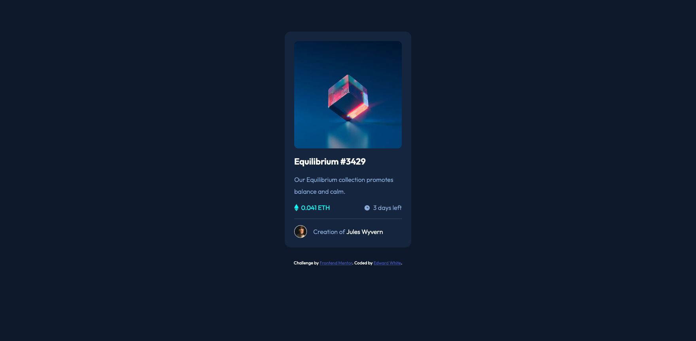

# Frontend Mentor - NFT preview card component solution

This is a solution to the [NFT preview card component challenge on Frontend Mentor](https://www.frontendmentor.io/challenges/nft-preview-card-component-SbdUL_w0U). Frontend Mentor challenges help you improve your coding skills by building realistic projects.

## Table of contents

- [Overview](#overview)
  - [The challenge](#the-challenge)
  - [Screenshot](#screenshot)
  - [Links](#links)
- [My process](#my-process)
  - [Built with](#built-with)
  - [What I learned](#what-i-learned)
- [Author](#author)

## Overview

### The challenge

Users should be able to:

- View the optimal layout depending on their device's screen size
- See hover states for interactive elements

### Screenshot



### Links

- Solution URL: [Frontend Mentor](https://www.frontendmentor.io/solutions/nft-preview-card-using-vanilla-css-ui6phmAWN)
- Live Site URL: [GitHub Pages](https://ewhite1999.github.io/nft-preview-card-component-main/)

## My process

### Built with

- Semantic HTML5 markup
- Vanilla CSS
- Flexbox

### What I learned

The main things I learnt/had to look up in this project are:

- Box sizing needs to be set like this to apply to everything:

```css
*,
*::after,
*::before {
  box-sizing: inherit;
}
:root {
  box-sizing: border-box;
}
```

- How to center an image with absolute positioning:

```css
.container {
  position: relative;
}
.absolute_center {
  position: absolute;
  left: 0;
  right: 0;
  top: 0;
  bottom: 0;
  margin: auto;
}
```

- How to overlay a colour on an image when hovered:

```css
.img_container {
  background-color: var(--overlay_colour);
  line-height: 0;
}
.img_container img:hover {
  opacity: 0.5;
}
```

## Author

- Frontend Mentor - [@ewhite1999](https://www.frontendmentor.io/profile/ewhite1999)
